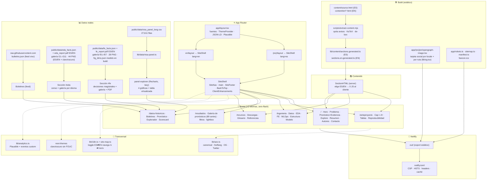

<p align="center">
  
  
  
  
</p>

# VisaPredict AI — sitio del proyecto (MIAAD · UACJ)

Sitio editorial estilo *data journalism* del anteproyecto **VisaPredict AI**
(predicción de fechas de prioridad del *U.S. Visa Bulletin*). Reconstruido
(jun-2026) de un HTML estático único a una app **Next.js (App Router) +
TypeScript** bilingüe (ES/EN), con tema claro/oscuro, KaTeX, gráficas Recharts y
una tabla virtualizada sobre el panel real `y_{p,c,b,t}`. **Export estático** →
se publica en Netlify como sitio estático. En vivo: **https://visapredictai.com**

---

## Qué contiene el sitio (diagrama de flujo)



## Stack

- **Next.js 15** (App Router) · **TypeScript** · **Tailwind v4** · **shadcn-style primitives**
- **next-themes** (claro/oscuro sin FOUC) · **KaTeX** · **Recharts** · **TanStack Table + Virtual**
- **Export estático** (`output: "export"`, `trailingSlash`) → cualquier host estático
- **Plausible** (analítica cookieless + eventos personalizados)

## Idioma y diseño

- **Bilingüe ES/EN con rutas reales** (`/x` y `/en/x`), **server-rendered por
  idioma → cero flash**. `lib/site-map.ts` + `lib/i18n.ts` son la fuente de
  verdad; `SectionHTML` es server component (el contenido no viaja al cliente).
- **Sistema editorial** (sin tarjetas con borde — reglas finas + tipografía).
  Modo oscuro inspirado en Linear / GitHub Dark Dimmed. Azul UACJ. WCAG AA.

## Contenido académico

Prosa, glosario (42) y referencias (64) se preservan **literales** desde
`content/source.html` (ES) y `content/en/*.html` (EN, traducción fiel validada)
y se transforman en build a `lib/content/sections.*generated.ts`. Datos reales
del repo `UACJ-MIAAD/VisaPredictAI`; sin valores inventados.

## Asistente VisaBot (RAG)

Asistente conversacional **RAG real, cero datos inventados**, en el widget flotante
y en la consola `/asistente`. Todo el índice y la recuperación corren **en el
navegador**; solo la generación pasa por una función.

- **Recuperación híbrida single-sourced** en `lib/visabot/retrieval-core.mjs`
  (fuente única que importan `components/visabot/engine.ts` y los tres
  `scripts/rag-*.mjs`, para que los evals midan exactamente lo que se envía):
  denso (coseno sobre `multilingual-e5-small` q8 auto-hospedado) + **BM25 Okapi**
  → **Reciprocal Rank Fusion** → **reranker léxico** (title-hit + boost
  glosario/hecho en preguntas de definición + penalización off-locale) →
  **MMR**. Expansión de acrónimos (`dates for filing`→DFF) y recuperación
  cross-lingual cuando el idioma de la consulta ≠ el de la página.
- **Arranque instantáneo**: BM25 responde de inmediato (recall@6 100 % sin el
  motor semántico); el modelo (~150 MB) se descarga **solo con consentimiento**
  del usuario, con **% de progreso** en la píldora de estado.
- **Generación citada** vía `netlify/functions/chat.mjs` — proxy *streaming* a
  Claude con defensas: guardián de código determinista, allowlist sha256 del
  contexto (anti prompt-injection), normalización de historial, rate-limit y
  allowlist de origen. Sin `ANTHROPIC_API_KEY` cae a respuesta **extractiva**
  citada. Citas `[n]` que enlazan a la sección fuente.
- **Consola con visualizaciones** desde el panel real (`lib/visabot/analytics.ts`):
  evolución, comparación por país, movimiento mensual, mezcla C/F/U, carrera de
  países, mapa de calor, radar, **pronóstico (fan-chart 80/95 %)**, tabla mensual
  y **comparación de dos boletines** (qué avanzó / retrocedió / cambió de estado).
  Tras cada respuesta, **chips de seguimiento** contextuales.
- **Evaluación**: `npm run rag:gate` (benchmark de recuperación con umbrales de
  CI, incl. flagship «cuál gana» y BM25-only), `npm run guard:test`
  (guardián de código), `npm test` (unit: builders, retrieval-core, sanitize).

## Rutas y bundle

| Ruta (×2 idiomas) | Contenido | First Load JS |
|---|---|---|
| `/` · `/en` | Hero · Problema (G1) · Pronóstico+Evidencia · Explore · Resumen · Autores | ~134 kB |
| `/anteproyecto` | Capítulos I–IV · Tablas · Reproducibilidad | ~111 kB |
| `/ingenieria` | Panel · EDA · FE · MLOps · Estructura · Modelo de datos | ~151 kB |
| `/datos-historicos` | Boletines en vivo · pronóstico por categoría · explorador · scorecard prospectivo | ~249 kB |
| `/resultados` | Galería de pronósticos (89 series) · filtros · tarjetas sparkline · lightbox (fan-chart, comparación) | — |
| `/recursos` | Descargas · Glosario · Referencias IEEE | ~151 kB |

## Desarrollo

```bash
npm install
npm run dev        # http://localhost:3000 (corre el extractor antes)
npm run build      # genera contenido + export estático en out/
npm run typecheck  # tsc --noEmit
npm run lint       # eslint .
```

## SEO · social · PWA · seguridad

- **SEO**: canonical + hreflang `es⇄en`, `robots.txt`, `sitemap.xml`, JSON-LD.
- **Social**: Open Graph + Twitter cards + imagen OG generada (1200×630).
- **PWA/móvil**: `manifest.webmanifest`, `apple-touch-icon`, `favicon.ico` (multi-res), `theme-color`.
- **A11y**: skip-link, foco gestionado, AA, `prefers-reduced-motion`.
- **Seguridad**: CSP **por página sin `unsafe-inline`** (hashes sha256 emitidos por `scripts/build-csp.mjs` en postbuild → `out/_headers`); HSTS, X-Frame-Options, Referrer-Policy, Permissions-Policy y caché inmutable en `netlify.toml`.

## Despliegue

- **Netlify**: `command = npm run build`, `publish = out` (`netlify.toml`). Auto-deploy desde `main`.
- Cualquier hosting estático sirve `out/`.

## Analítica — eventos personalizados de Plausible

**Dashboard de estadísticas:** https://plausible.io/visapredictai.com
(panel cookieless de visitas, fuentes, páginas y eventos).

`lib/analytics.ts` → `track()`. Eventos principales: `Language Switch`, `Theme Toggle`,
`Explore Section`, `Forecast CTA`, `Forecast View`, `CSV Export`, `Explorer Filter`
y la familia VisaBot (inventario completo: `grep -rn "track(" components lib`).
Para verlos: registrarlos como **Goals → Custom event** en el panel de Plausible.
