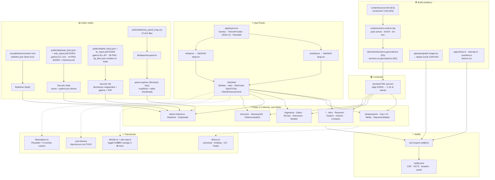

<p align="center">
  
  
  
  
</p>

# VisaPredict AI — sitio del proyecto (MIAAD · UACJ)

Sitio editorial estilo *data journalism* del anteproyecto **VisaPredict AI**
(predicción de fechas de prioridad del *U.S. Visa Bulletin*). Reconstruido
(jun-2026) de un HTML estático único a una app **Next.js (App Router) +
TypeScript** bilingüe (ES/EN), con tema claro/oscuro, KaTeX, gráficas Recharts y
una tabla virtualizada sobre el panel real `y_{p,c,b,t}`. **Export estático** →
se publica en Netlify como sitio estático. En vivo: **https://visapredictai.com**

---

## Qué contiene el sitio (diagrama de flujo)



## Stack

- **Next.js 15** (App Router) · **TypeScript** · **Tailwind v4** · **shadcn-style primitives**
- **next-themes** (claro/oscuro sin FOUC) · **KaTeX** · **Recharts** · **TanStack Table + Virtual**
- **Export estático** (`output: "export"`, `trailingSlash`) → cualquier host estático
- **Plausible** (analítica cookieless + 6 eventos personalizados)

## Idioma y diseño

- **Bilingüe ES/EN con rutas reales** (`/x` y `/en/x`), **server-rendered por
  idioma → cero flash**. `lib/site-map.ts` + `lib/i18n.ts` son la fuente de
  verdad; `SectionHTML` es server component (el contenido no viaja al cliente).
- **Sistema editorial** (sin tarjetas con borde — reglas finas + tipografía).
  Modo oscuro inspirado en Linear / GitHub Dark Dimmed. Azul UACJ. WCAG AA.

## Contenido académico

Prosa, glosario (42) y referencias (64) se preservan **literales** desde
`content/source.html` (ES) y `content/en/*.html` (EN, traducción fiel validada)
y se transforman en build a `lib/content/sections.*generated.ts`. Datos reales
del repo `UACJ-MIAAD/VisaPredictAI`; sin valores inventados.

## Rutas y bundle

| Ruta (×2 idiomas) | Contenido | First Load JS |
|---|---|---|
| `/` · `/en` | Hero · Resumen · navegador · Autores · Contacto | ~111 kB |
| `/anteproyecto` | Capítulos I–IV · Tablas · Reproducibilidad | ~111 kB |
| `/ingenieria` | Panel · MLOps · Estructura · Modelo de datos | ~111 kB |
| `/datos-historicos` | Boletines en vivo · explorador interactivo | ~124 kB |
| `/recursos` | Glosario (42) · Referencias IEEE (64) | ~111 kB |

## Desarrollo

```bash
npm install
npm run dev        # http://localhost:3000 (corre el extractor antes)
npm run build      # genera contenido + export estático en out/
npm run typecheck  # tsc --noEmit
npm run lint       # eslint .
```

## SEO · social · PWA · seguridad

- **SEO**: canonical + hreflang `es⇄en`, `robots.txt`, `sitemap.xml`, JSON-LD.
- **Social**: Open Graph + Twitter cards + imagen OG generada (1200×630).
- **PWA/móvil**: `manifest.webmanifest`, `apple-touch-icon`, `favicon.ico` (multi-res), `theme-color`.
- **A11y**: skip-link, foco gestionado, AA, `prefers-reduced-motion`.
- **Seguridad** (`netlify.toml`): CSP, HSTS, X-Frame-Options, Referrer-Policy, Permissions-Policy + caché inmutable.

## Despliegue

- **Netlify**: `command = npm run build`, `publish = out` (`netlify.toml`). Auto-deploy desde `main`.
- Cualquier hosting estático sirve `out/`.

## Analítica — eventos personalizados de Plausible

**Dashboard de estadísticas:** https://plausible.io/visapredictai.com
(panel cookieless de visitas, fuentes, páginas y eventos).

`lib/analytics.ts` → `track()`. Eventos: `Language Switch`, `Theme Toggle`,
`Explore Section`, `Explore Historical CTA`, `CSV Export`, `Explorer Filter`.
Para verlos: registrarlos como **Goals → Custom event** en el panel de Plausible.
