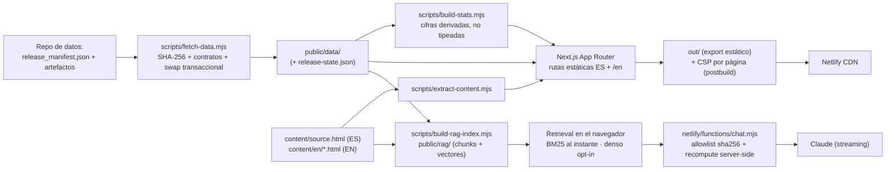

# VisaPredict AI — web y VisaBot

[](https://github.com/UACJ-MIAAD/VisaPredictAI_WEB/actions/workflows/ci.yml)
[](package.json)
[](tsconfig.json)
[](tests/e2e)
[](LICENSE)

Sitio bilingüe (ES/EN) estilo *data journalism* del proyecto **VisaPredict AI**
(predicción de fechas de prioridad del *U.S. Visa Bulletin*, MIAAD · UACJ) y
consola del asistente **VisaBot**. Consume un **release verificado** del
[repositorio de datos y modelado](https://github.com/UACJ-MIAAD/VisaPredictAI),
lo presenta como app **Next.js 15** de export estático y usa una única Netlify
Function para la generación conversacional.

**Producción:** <https://visapredictai.com>

## Contenido

- [Quickstart](#quickstart)
- [Arquitectura](#arquitectura)
- [Rutas](#rutas)
- [VisaBot](#visabot)
- [Datos y releases](#datos-y-releases)
- [Calidad, accesibilidad y rendimiento](#calidad-accesibilidad-y-rendimiento)
- [Despliegue](#despliegue)
- [Privacidad y seguridad](#privacidad-y-seguridad)
- [Contribuir](#contribuir)
- [Licencia y cita](#licencia-y-cita)

## Quickstart

Requiere Node 22+ (el CI corre con Node 22).

```bash
git clone https://github.com/UACJ-MIAAD/VisaPredictAI_WEB.git && cd VisaPredictAI_WEB
npm ci
npm run dev
```

Abra <http://localhost:3000>. `npm run dev` regenera antes las estadísticas
derivadas y el contenido académico (`predev`).

- **Build reproducible sin red:** `npm run build:offline` — usa los fallbacks
  commiteados de `public/data/` como fixture inmutable, exporta a `out/`,
  emite la CSP, verifica el export y aplica los presupuestos de peso.
- **Build de producción (el de Netlify):** `npm run build` — su `prebuild`
  descarga el release del repo de datos, construye el índice RAG (requiere
  bajar el modelo de embeddings) y corre el gate de retrieval.
- **Validación completa (lo que gatea el CI):**

  ```bash
  npm run lint && npm run typecheck && npm run test:coverage
  npm run guard:test        # guardián de código del VisaBot
  npm run test:e2e:build    # build offline + Playwright (responsive, teclado, axe, touch targets)
  ```

## Arquitectura



El build valida hashes y contratos **antes** de un swap transaccional con
rollback: un fallo conserva el corte anterior entero (nunca se mezclan archivos
de releases distintos). La UI muestra el `release_id` de los bytes realmente
servidos y todo número visible en el sitio se **deriva** de los artefactos del
corte (`build-stats.mjs`), no se tipea a mano.

## Rutas

Cada ruta existe en ES (raíz) y EN (`/en/...`), server-rendered por idioma
(cero flash). La fuente única de rutas, secciones y anclas es
[`lib/site-map.ts`](lib/site-map.ts); no duplique navegación en componentes.

- `/` y `/en` — portada editorial: problema, pronóstico y evidencia, explorar.
- `/anteproyecto` — el documento académico: capítulos I–IV, tablas, reproducibilidad.
- `/ingenieria` — construcción del panel, EDA, feature engineering, MLOps, estructura, modelo de datos.
- `/datos-historicos` — boletines en vivo, pronóstico, explorador histórico, marcador prospectivo.
- `/resultados` — galería filtrable de las series de pronóstico, con lightbox de fan charts y comparación.
- `/recursos` — descargas, glosario, referencias IEEE.
- `/asistente` — consola de VisaBot con visualizaciones.

Los tamaños de bundle por ruta los reporta `next build` en cada compilación y
los techos de peso del export se gatean con
[`docs/perf_budgets.json`](docs/perf_budgets.json); no se congelan aquí.

## VisaBot

Asistente conversacional RAG sobre la documentación del proyecto y el panel
real, en el widget flotante y en la consola `/asistente`.

1. **Índice en build** (`npm run build:rag`): contenido académico ES/EN, docs
   del repo de datos leídos a SHA pineado del release y hechos del boletín
   vivo → `public/rag/` (chunks, vectores, `meta.json` con bloque de
   gobernanza).
2. **BM25 responde al instante** con los chunks textuales; el motor denso
   (`multilingual-e5-small` q8, auto-hospedado) se descarga **solo con
   consentimiento explícito** del usuario, con porcentaje de progreso.
3. **Recuperación híbrida single-sourced** en
   [`lib/visabot/retrieval-core.mjs`](lib/visabot/retrieval-core.mjs)
   (BM25 + denso → Reciprocal Rank Fusion → rerank léxico → MMR): el motor del
   navegador y los evals importan la misma función, así que las métricas miden
   exactamente lo que se envía.
4. **Generación citada** vía [`netlify/functions/chat.mjs`](netlify/functions/chat.mjs),
   proxy *streaming* a Claude. El contexto documental solo se acepta si su
   sha256 está en el allowlist del índice publicado. El contexto **numérico**
   (tablas de mes, comparaciones, pronósticos) ya no viaja como texto del
   cliente: el cliente envía **descriptores estructurados** y el **servidor
   reconstruye** el texto desde los artefactos del release, re-verificados
   contra pins sha256 fijados en build, con los mismos builders que renderiza
   el navegador. Sin `ANTHROPIC_API_KEY`, cae a una respuesta extractiva
   citada.
5. **Límites explícitos:** más allá del horizonte validado del sistema, el
   prompt ordena abstención (no extrapola); las respuestas citan `[n]` con
   enlace a la sección fuente.

```bash
npm run build:rag         # construye el índice (descarga el modelo de embeddings)
npm run rag:gate          # gate de retrieval por estrato (recall@6, MRR, flagship, BM25-only)
npm run rag:golden:gate   # gate generativo determinista sobre el golden set curado
npm run guard:test        # suite del guardián de código del proxy
```

El golden set curado vive en [`evals/golden/`](evals/golden) (factual,
forecast, multiturn, poisoning, unanswerable, más un hold-out); sus umbrales y
**limitaciones honestas** (una cita presente no equivale a *faithfulness*)
están en [`docs/VISABOT_EVAL.md`](docs/VISABOT_EVAL.md). Manual del operador:
[`docs/VISABOT.md`](docs/VISABOT.md).

## Datos y releases

- El repo de datos publica un **manifiesto de release**
  (`reports/release/release_manifest.json`) con SHA-256, tamaño y criticidad
  por artefacto bajo un `release_id` content-addressed.
- [`scripts/fetch-data.mjs`](scripts/fetch-data.mjs) descarga todo a staging,
  **verifica cada hash**, valida los payloads contra los contratos
  vendorizados de [`lib/contracts/`](lib/contracts) y solo entonces hace el
  swap transaccional a `public/data/`. Cualquier fallo conserva el corte
  anterior completo.
- El corte servido es inspeccionable en
  [`/data/release-state.json`](https://visapredictai.com/data/release-state.json)
  (`fresh · stale · incompatible · legacy`, con el `release_id` de los bytes
  que realmente se sirven); el pie de página del sitio lo muestra.
- [`lib/repo.mjs`](lib/repo.mjs) es la **única** fuente de la URL raw del repo
  de datos; el contenido que se convierte en conocimiento del RAG se lee al
  SHA de git pineado por el manifiesto, no a `main`.
- `public/data/` y `public/rag/` son **generados**; no se editan a mano.

Cuando el repo de datos publica un boletín nuevo, su workflow dispara el build
hook de Netlify y el sitio se reconstruye y re-verifica solo.

## Calidad, accesibilidad y rendimiento

```bash
npm run lint            # eslint --max-warnings=0
npm run typecheck       # tsc --noEmit (strict)
npm test                # vitest (builders, retrieval, contratos, release, i18n, ...)
npm run test:coverage   # vitest + pisos de cobertura por área
npm run test:e2e        # Playwright sobre el export de out/
```

- **Cobertura honesta, con denominador visible:** la config de vitest
  instrumenta **todo** `lib/` + `netlify/functions/` (los módulos sin tests
  cuentan al 0 %; componentes React y `*.generated.ts` quedan fuera, ver
  [`vitest.config.ts`](vitest.config.ts)). Baseline medida el 2026-07-12:
  ~72 % de *statements* global, con pisos por módulo crítico (release, panel,
  forecasts, contexto sintético ≥ 80–90 %). El CI publica cubierto/total en el
  *job summary* para que el porcentaje no se lea contra otro denominador.
- **E2E portable** ([`tests/e2e/`](tests/e2e)): matriz responsive de 9 anchos
  (320–3440 px) × ES/EN × claro/oscuro, navegación por teclado, barrido
  **axe-core** (0 violaciones *serious/critical* en las rutas clave) y tamaño
  de blancos táctiles, contra el mismo export offline que valida el CI.
- **Presupuestos de peso** (`docs/perf_budgets.json` +
  `scripts/check-budgets.mjs`, dentro de `build:offline`): JS, datos, índice
  RAG, wasm de ORT e higiene de variantes de imagen (AVIF/WebP junto a cada
  PNG de galería).

## Despliegue

- **Netlify**: `command = npm run build`, `publish = out`
  ([`netlify.toml`](netlify.toml)), auto-deploy desde `main`.
- El CI ([`.github/workflows/ci.yml`](.github/workflows/ci.yml)) corre en cada
  push/PR: typecheck, lint, unit + cobertura, guardián del VisaBot, sets de
  evaluación, el **mismo build offline** con verificación del export, y la
  suite E2E; un job no bloqueante verifica que el manifiesto publicado siga
  siendo alcanzable de punta a punta. La suite completa de calidad RAG y el
  audit de dependencias corren programados en
  [`scheduled-quality.yml`](.github/workflows/scheduled-quality.yml).
- Tras un deploy, verifique `/data/release-state.json` (estado y `release_id`
  servidos).
- La única variable sensible (`ANTHROPIC_API_KEY`) vive en Netlify; nunca use
  el prefijo `NEXT_PUBLIC_` para secretos.
- Cualquier hosting estático puede servir `out/`.

## Privacidad y seguridad

- **Analítica cookieless** (Plausible) con eventos personalizados
  (`lib/analytics.ts`); sin cookies de rastreo.
- **CSP por página sin `unsafe-inline` en `script-src`**: hashes sha256 por
  inline script emitidos en postbuild (`scripts/build-csp.mjs` → `out/_headers`;
  `style-src` conserva `unsafe-inline` por los estilos inline de
  Tailwind/React). HSTS, `X-Frame-Options`, `Referrer-Policy` y
  `Permissions-Policy` en `netlify.toml`.
- **Proxy del VisaBot endurecido**: allowlist sha256 del contexto documental,
  recompute server-side del contexto numérico (el servidor no lee ni una cifra
  del cliente), guardián de código determinista sobre el stream, rate
  limiting, allowlist de origen, tope de body por streaming y timeout del
  upstream. Estas defensas complementan, no sustituyen, la evaluación continua.
- **Modelo de amenazas** del producto web (superficies, actores, mitigaciones y
  residuales) en [`docs/THREAT_MODEL.md`](docs/THREAT_MODEL.md).
- **Dependencias**: triage y política de SLA por severidad en
  [`docs/SECURITY_TRIAGE.md`](docs/SECURITY_TRIAGE.md); el audit del lockfile
  corre semanalmente en CI.

## Contribuir

PRs pequeñas y con prueba. Antes de abrir una:

```bash
npm run lint && npm run typecheck && npm run test:coverage && npm run build:offline
```

Cambios al RAG deben pasar `npm run rag:gate` y `npm run rag:golden:gate`;
cambios visuales, la suite E2E (`npm run test:e2e:build`); cambios de contrato
de datos requieren actualizar `lib/contracts/` en la misma tanda que el
productor y validar con un fetch real (`node scripts/fetch-data.mjs`).

## Licencia y cita

Código bajo [MIT](LICENSE), igual que el
[repo de datos](https://github.com/UACJ-MIAAD/VisaPredictAI). Cada fuente de
datos conserva su licencia y procedencia; la fuente primaria es el *Visa
Bulletin* del U.S. Department of State. Para citar el proyecto, use el
repositorio de datos e indique el `release_id` del corte utilizado (visible en
`/data/release-state.json`).
